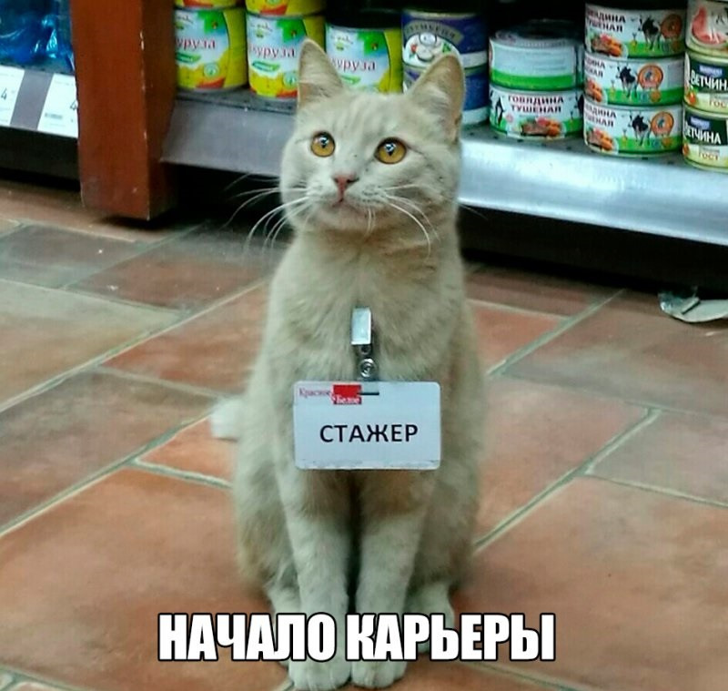

# Начинаем знакомство с Git и языком разметки MarkDown

## Начнем с языка разметки MarkDown
1. Заголовки 
>отмечаются в начале строки знаком # , подзаголовок ## и так далее.
2. Уровни заголовков 
> отмечаются подчеркиванием строки знаком ====
или знаком ****
3. Жирный текст
> для выделения текста жирным шрифтом необходимо в начале и в конце поставить по 2 звездочки ** 
* **пример**
4. Курсивный текст 
> для выделения текста курсивом необходимо также в начале и в конце текста поставить по одной звездочке *
* *пример*
5. Нумерованные списки 
>  собственно уже значатся, для маркировки используем цифру, точку, пробел, и текст (1. пример)
#### Списки
1. молоко
2. хлеб
3. мука
4. и.т.д.

5.Ненумерованные списки
> обозначаются звездочкой (*) через пробел в начале строки, пример
* молоко
* хлеб
* вода
* и.т.д.

6.Цитаты
>для обозначения цитаты используется знак больше (>) в начале текста, весь текст в примерах)

# Основные команды в терминале при работе с Git
* git init - инициализация репозитория (папки) в которой git, будет отслеживать измения
* git add name - добавление файла для отслеживания где name имя файла.
* git commit - m "текст" - сохраняет измения в файле , где тест например пометить изменения
* git log - вызвать список действий и изменений
* git diff - показать разницу изменений
* git checkout - переключение между версиями
* git status -   показывает состояния файлов в репозитории, какие файлы изменены, какие ожидают коммита.

# Добавим изображение
Чтобы вставить изображение, необходио файл скопировать в текущий репозиторий и добавить в текст следующим образом
* 

# Ссылки 
>  Для создания внутритекстовой гиперссылки необходимо использовать круглые скобки сразу после закрывающей квадратной, пример ниже.

[наш образовательный портал](https://gb.ru/)

>или ссылка с подсказкой 

[наш образовательный портал](https://gb.ru/ Geek Brains)

Вот как то так , всем спасибо!)))
****

## Углубляемся в ветвление 
 ### команды:
